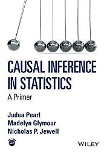
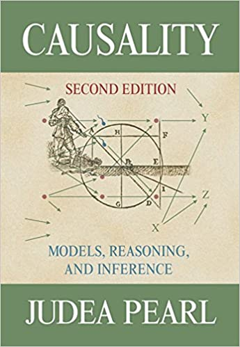

# Causality

How do causes lead to effects? Can you associate the cause leading to the observed effect? Big Data opens the doors for us to be able to answer questions such as this, but before we are able to do so, we must dive into the field of Causal Inference, a field championed by Judea Pearl.
In this series of blog posts we will learn about the main ideas of Causality by working our way through “Causal Inference In Statistics” a nice Primer co-authored by Pearl himself.

  
  Amazon Affiliate Link: https://amzn.to/3gsFlkO

The book is divided into Four chapters. The first chapter covers background material in probability and statistics. The other three chapters are (roughly) organized to match the “Three steps” in the ladder of causality as defined by Pearl:

1. — Association
2. — Intervention
3. — Counterfactuals

In this series of blog posts we will cover most of the content of the book, with a special emphasis on the parts that I believe are more interesting or relevant to practical applications. In addition to summarizing and explaining the content, we will also explore some of the ideas using simple (or as simple as possible) Python code you can run on Binder: 

## Chapter 1
1.2 - [Simpson's Paradox](https://medium.com/data-for-science/causal-inference-part-i-415538211aa1) -- [1.2 - Simpson's Paradox.ipynb](https://github.com/DataForScience/Causality/blob/master/1.2%20-%20Simpson's%20Paradox.ipynb)

1.3 - [Probability Theory](https://medium.com/data-for-science/causal-inference-part-ii-probability-theory-8fc804fa8240) -- [1.3 - Probability and Statistics.ipynb](https://github.com/DataForScience/Causality/blob/master/1.3%20-%20Probability%20and%20Statistics.ipynb)

1.4 - [Graphs](https://medium.com/data-for-science/causal-inference-part-iii-graphs-df043300add1) -- [1.4 - Graphs.ipynb](https://github.com/DataForScience/Causality/blob/master/1.4%20-%20Graphs.ipynb)

1.5 - [Structural Causal Models](https://medium.com/data-for-science/causal-inference-part-iv-structural-causal-models-df10a83be580) -- [1.5 - Structural Causal Models.ipynb](https://github.com/DataForScience/Causality/blob/master/1.5%20-%20Structural%20Causal%20Models.ipynb)

## Chapter 2
2.2 - [Chains and Forks](https://medium.com/data-for-science/causal-inference-part-v-chains-and-forks-7b0b088c346e) -- [2.2 - Chains and Forks.ipynb](https://github.com/DataForScience/Causality/blob/master/2.2%20-%20Chains%20and%20Forks.ipynb)

2.3 - [Colliders](https://medium.com/data-for-science/causal-inference-part-vi-colliders-af07301c9a15) -- [2.3 - Colliders.ipynb](https://github.com/DataForScience/Causality/blob/master/2.3%20-%20Colliders.ipynb)

2.4 - [d-separation](https://medium.com/data-for-science/causal-inference-part-vii-d-separation-aa74e361d34e) -- [2.4 - d-separation.ipynb](https://github.com/DataForScience/Causality/blob/master/2.4%20-%20d-separation.ipynb)

For a more in-depth analysis, checkout Pearl's more technical book:

  
  Amazon Affiliate Link: https://amzn.to/2OSBP6u

